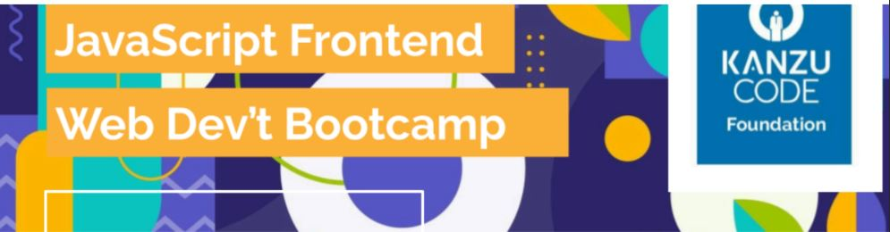
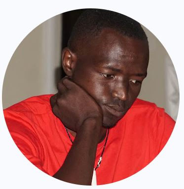

# Coding Challenge Set Two
  This is an individual assignment for every one in the bootcamp;
  ## heading Link
  
  
  # JavaScript Practice Challenges 
  

  

## Project description.
 This is an individual assignment.
 ## The assignment is to complete the following challenges in JavaScript.
1. Given an Array containing integers, floats, and one character strings, write a function that takes an Array as a parameter and returns an Object with keys evens, odds, and chars. The value for evens is an array of sorted even numbers, the value for odds is a list of sorted odd numbers and chars is a list of sorted single-character strings.
Caution: DO NOT use the sort array method

2. Given an integer array nums, return true if any value appears at least twice in the array, and return false if every element is distinct.
   
3. Given an array nums of size n, return the majority element. The majority element is the element that appears more than ⌊n / 2⌋ times. You may assume that the majority element always exists in the array.

4. Given a non-empty array of integers nums, every element appears twice except for one. Find that single one.

5. Write a function to find the longest common prefix string amongst an array of strings. If there is no common prefix, return an empty string "".
   ## About
   Done by: IvanJ
   

